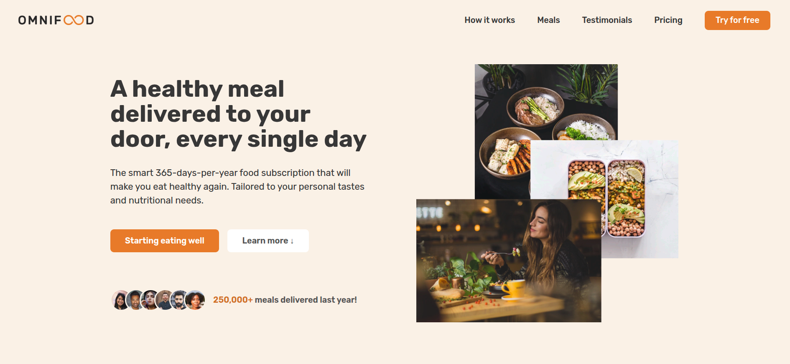

<div align="center">

# 🥗 Omnifood

  

Omnifood is a responsive landing page built for a fictional AI-powered meal planning company. This project was developed as the final assignment of an HTML5 and CSS3 course, and marks my first front-end project — built entirely from scratch, with no frameworks or builders involved.

</div>

## 📖 About

> _We are a technology company first, but with a major focus on consumer well-being through a healthy diet._

Modern life leaves little time for cooking, which can lead to a poor diet and lasting health consequences. Omnifood tackles this with an AI-centric approach:

- Users select their diet preferences and foods they like or dislike.
- The AI algorithm generates a fully personalized weekly meal plan.
- Partner restaurants and cooking partners prepare and deliver every meal directly to the user's door, in selected cities.
- Everything is bundled into a monthly subscription — with the option to receive one or two meals per day, every single day of the month.

## ✨ Features

- **Fully responsive layout** — adapted for mobile, tablet, and desktop screens via custom media queries.
- **No frameworks or builders** — every line of HTML, CSS, and JavaScript was written by hand.
- **PWA-ready** — includes a `manifest.webmanifest` for basic Progressive Web App support.
- **Clean architecture** — styles are split across three focused files to separate concerns: base tokens, component styles, and responsive rules.

## 🎬 Demo



⛓️‍💥 [Live demo](https://pmbfsa.github.io/omnifood/)

## 🚀 Getting Started

No build process or dependencies required. Just clone the repository and open the file in your browser:

```bash
git clone https://github.com/pmbfsa/omnifood
```

Then open `index.html` directly in your browser, or serve it locally using any static server, such as the [Live Server](https://marketplace.visualstudio.com/items?itemName=ritwickdey.LiveServer) extension for VS Code.

## 🗂️ Project Structure

```
omnifood/
├── css/
│   ├── general.css       # Reusable base styles and design tokens
│   ├── style.css         # Main page styles and components
│   └── queries.css       # Responsive media queries for all screen sizes
├── img/                  # All images and assets used across the page
├── js/
│   └── script.js         # Page interactivity and dynamic behavior
├── content.md            # Content briefing provided by the fictional client
├── index.html            # Main HTML entry point
└── manifest.webmanifest  # Web app manifest for PWA support
```

## ✒️ Author

Developed by [Paulo Márcio](https://github.com/pmbfsa) as the final project of an HTML5 & CSS3 course.

## 📄 License

This project is intended for educational purposes. The Omnifood brand, content, and design concept were provided as part of the course material.
